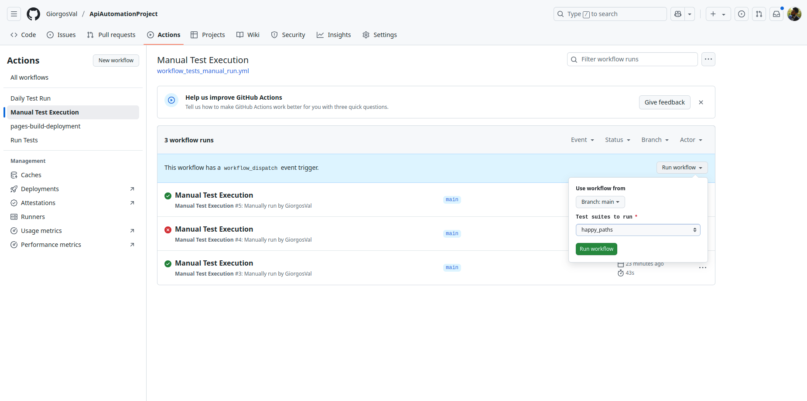
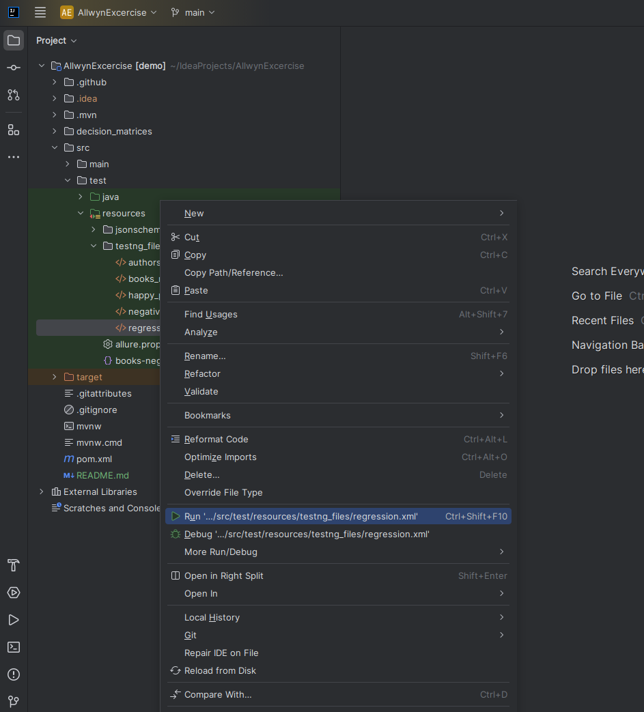
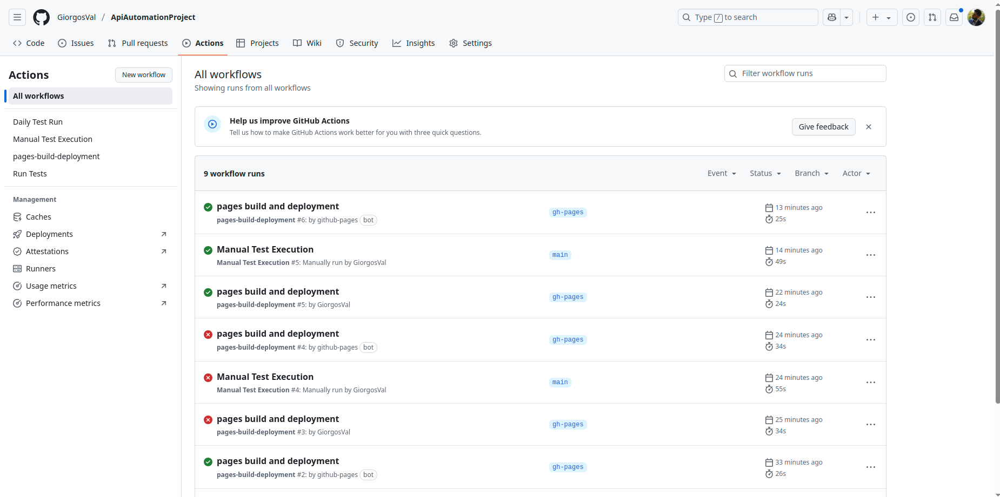
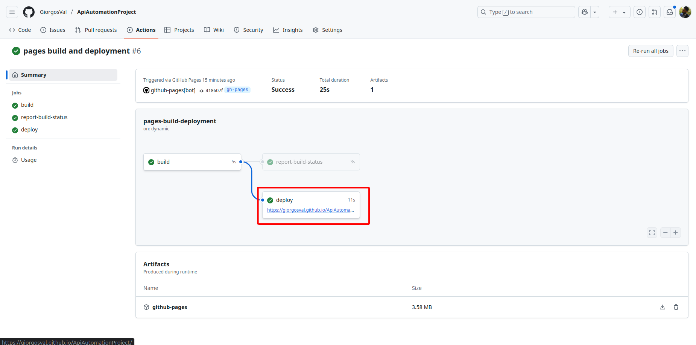
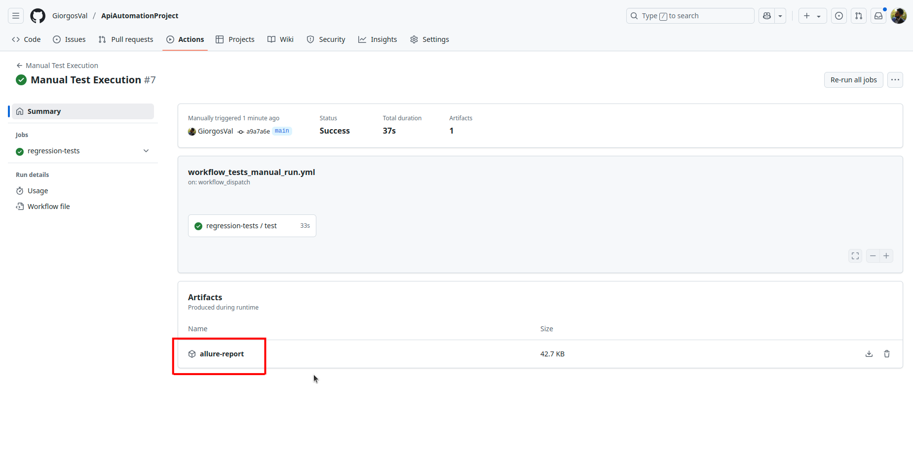
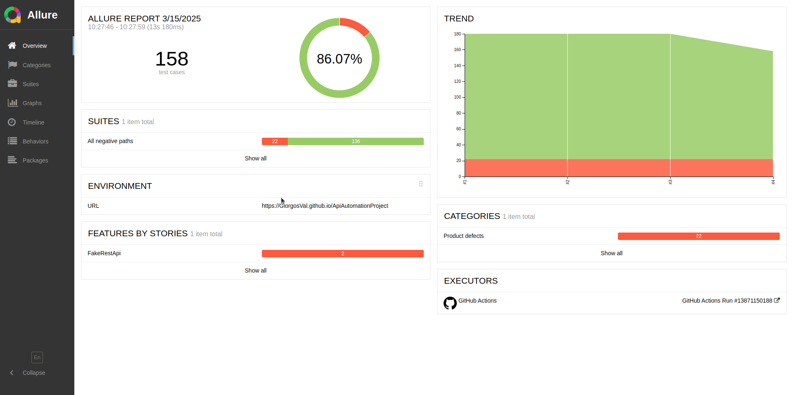
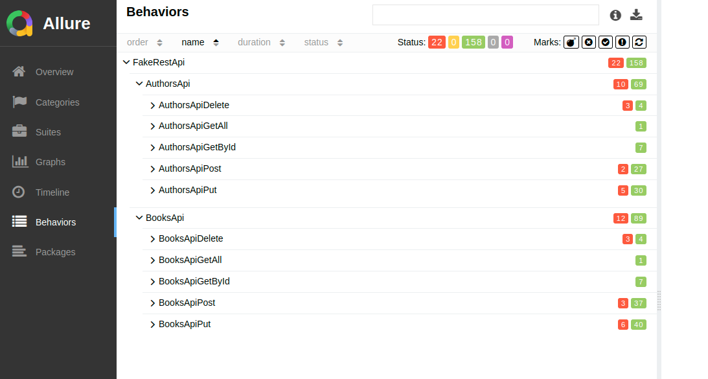
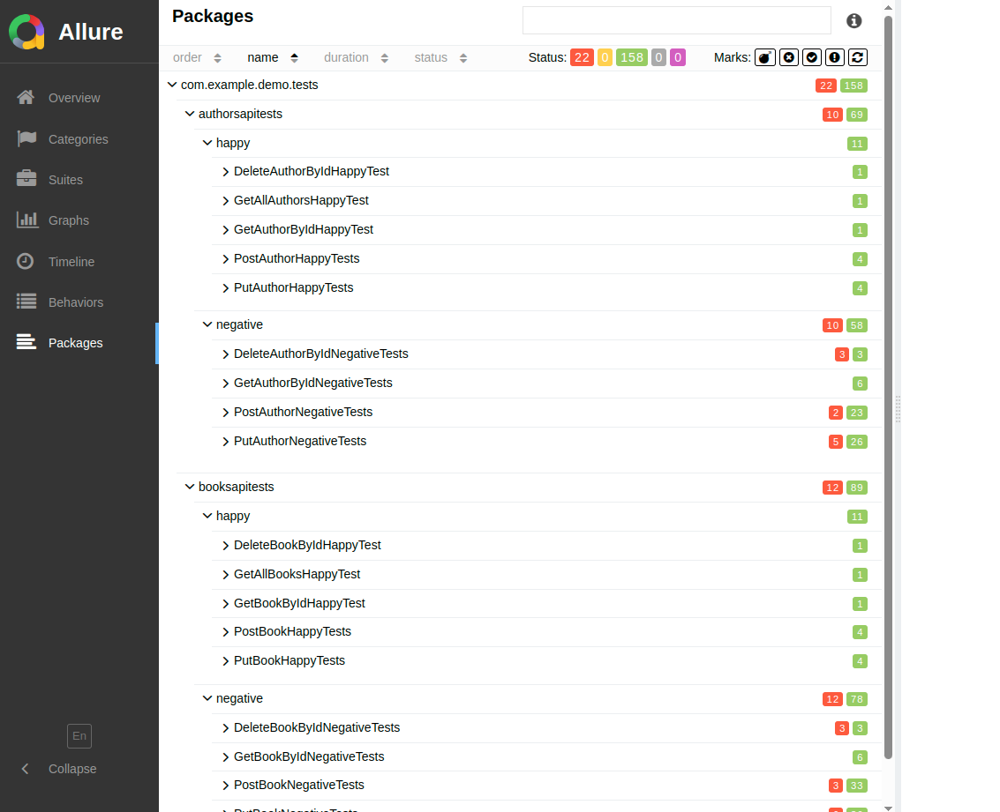
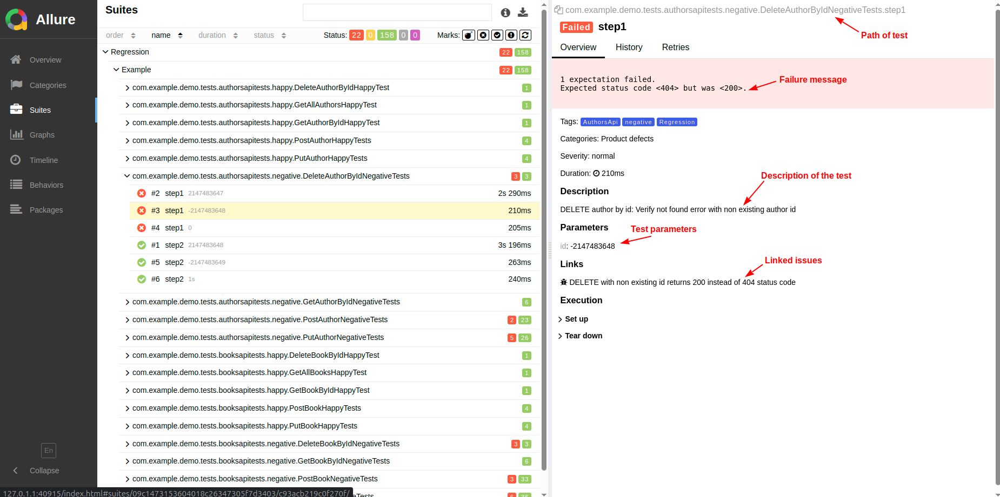

# API Automation Testing Assessment

This assessment is about creating a Software Test Automation project for some
of the endpoints of the [FakeRestAPI](https://fakerestapi.azurewebsites.net/index.html).

## How tests cases derived

In order to define the test cases, some assumptions should be done.
Please refer to the [Assumptions](decision_matrices/assumptions.md) file and
also checkout the decision matrices created for each endpoint
([Authors decision matrices](decision_matrices/authors_api_decision_matrix.md) and
([Books decision matrices](decision_matrices/books_api_decision_matrix.md)).

## Toolset used

- Java 17
- Maven
- SpringBoot
- RestAssured
- TestNG
- Allure Report
- GitHub actions

## How to run the tests

There are several `testng.xml` files created, that create various test suites. All are located
under the directory [src/test/resources/testng_files](src/test/resources/testng_files).
Here are their file paths:

- Full regression
  tests: [src/test/resources/testng_files/regression.xml](src/test/resources/testng_files/regression.xml)
- Only happy path
  tests: [src/test/resources/testng_files/happy_paths.xml](src/test/resources/testng_files/happy_paths.xml)
- Only negative path
  tests: [src/test/resources/testng_files/negative_paths.xml](src/test/resources/testng_files/negative_paths.xml)
- Only Authors endpoint
  tests: [src/test/resources/testng_files/authors_regression.xml](src/test/resources/testng_files/authors_regression.xml)
- Only Books endpoint
  tests: [src/test/resources/testng_files/books_regression.xml](src/test/resources/testng_files/books_regression.xml)

### Through GitHub actions

#### Manual Run

Given that you have a Collaborator access to the repository, you can trigger a manual run of the tests, by
following the below steps:

1. Visit
   the [Actions > Manual Test Execution page](https://github.com/GiorgosVal/ApiAutomationProject/actions/workflows/workflow_tests_manual_run.yml)
2. At the right of the screen, click on `Run workflow`, then select the branch and the test suite to run and click again
   `Run Workflow`
   

#### Scheduled Run

Additionally, an automated run is scheduled in daily basis at 3 AM UTC

### Locally (using the IntelliJ IDEA)

After you open the project, navigate to the aforementioned directory to find the `testng.xml` files.
Choose the file you want, right click on it, and select the option _"Run '../path/filename.xml'"_. For example:


### Locally (using Maven)

You can run the following CLI command to run the `testng.xml` file you want:

```bash
mvn clean test -Dsurefire.suiteXmlFiles=src/test/resources/testng_files/<FILENAME>.xml
```

For example, running the full regression would be:

```bash
mvn clean test -Dsurefire.suiteXmlFiles=src/test/resources/testng_files/regression.xml
```

## How to view the Test Report

### On GitHub pages

When the tests run through the GihHub Actions, the allure report:

- is published at the GitHub Pages (this is the use of `gh-pages` branch)
- is stored as zip artifact at the corresponding workflow run, to be available for downloading.

#### From the GitHub pages

Every report is added in the history. To find the latest report, first go to
the [Actions > All workflows](https://github.com/GiorgosVal/ApiAutomationProject/actions).
Then click on the workflow named `pages build and deployment`:


And click at the link under the `deploy` job:


#### From the corresponding workflow run

Visit the workflow that just ran. Under the `Artifacts` click at the `allure-report` to download it.


### View report locally

After you have run your tests locally, the test report will be available at the directory `target/allure-results`.
To open it locally you will need to have installed the `allure` command in your machine
(see the [official installation guide](https://allurereport.org/docs/install/)). Once you're set up,
you can open the report with the following command:

```bash
allure serve target/allure-results/
```

The above command will automatically open the report on your browser. If this doesn't happen, you can inspect
the terminal output. You should see something like this:

```bash
Server started at <http://127.0.1.1:40915/>. Press <Ctrl+C> to exit
```

You can click at the above URL `http://127.0.1.1:40915` or replace the IP with localhost `http://localhost:40915`

## Reading the Test Report

For a generic guide of the Allure Report, [visit this page](https://allurereport.org/docs/features-overview/).

In short, once the report opens, it will give you an overview of your test run (fail/pass rate).


You can navigate through your tests based on their category, at the Behaviors tab:


Or per package, at the Packages tab:


In any case, while navigating you will end up at the specific test steps, where you can
find information such us the reason of failure, the test description, the test parameters passed,
any linked issue, the location of the test, any many more.
